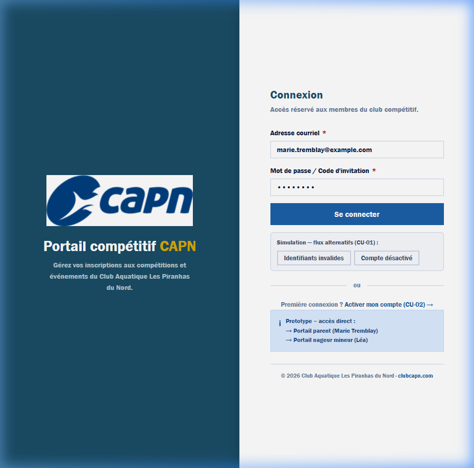
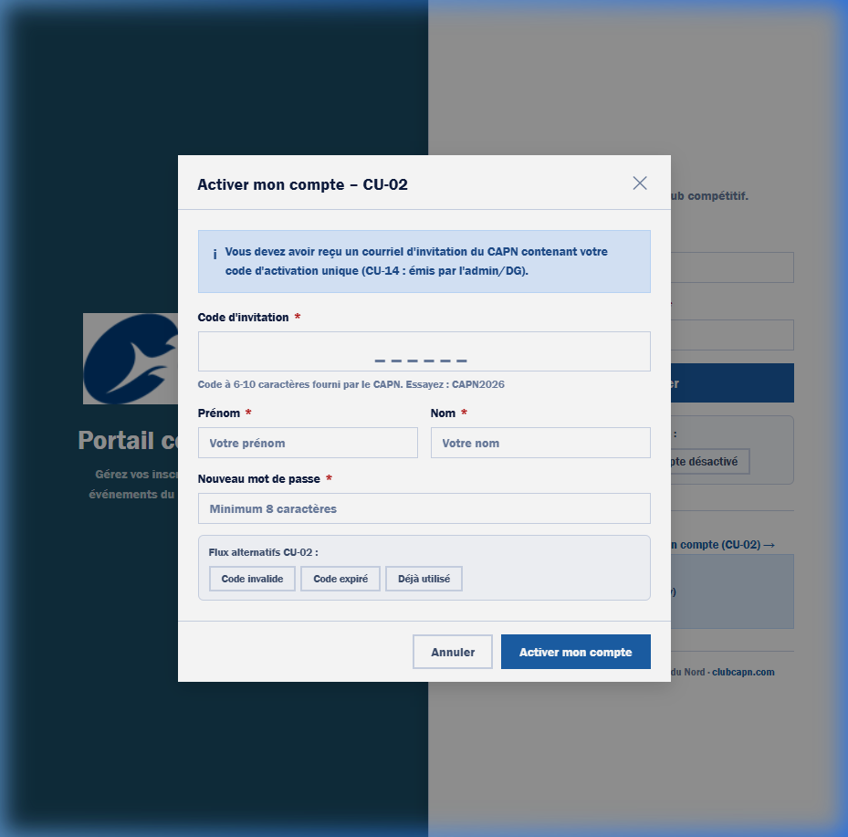
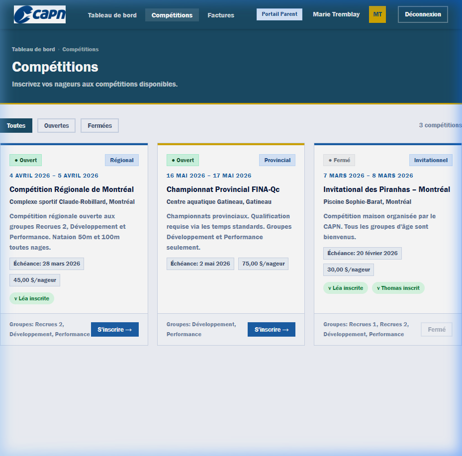
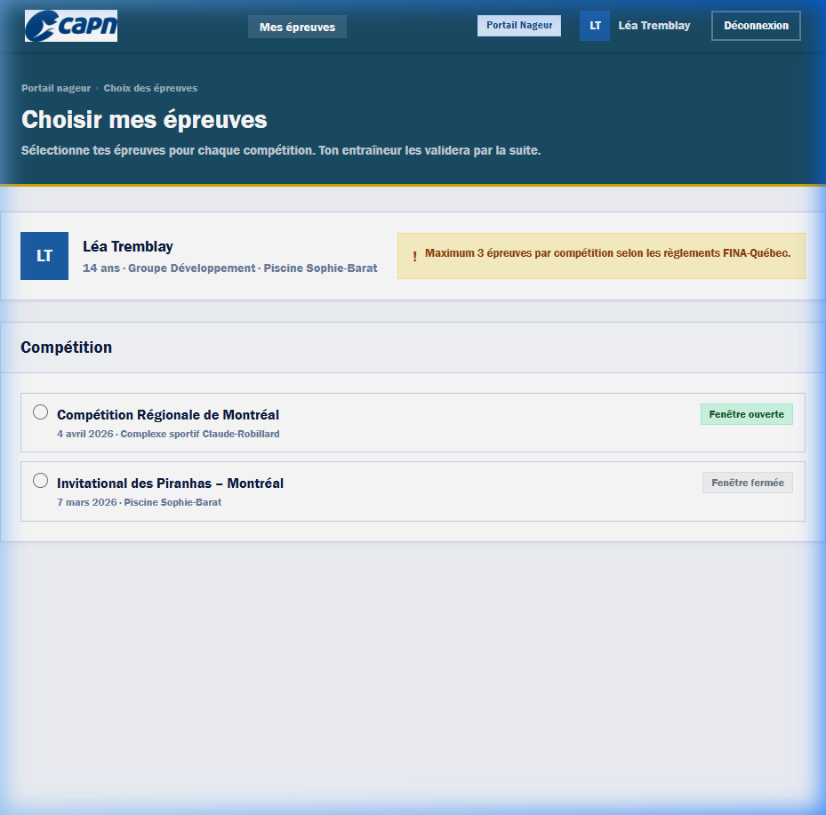

# Laboratoire 3 : Rapport de prototype

**Projet :** XYZ (Portail CAPN)  
**Équipe :** 3  

## Informations générales
- **Étudiants :** 
  - Anton, Andrei (ANTA63270301)
  - Bouhamed, Adel (BOUA74270301)
  - Ngo, Gordon (NGOG73360201)
  - Nguefack, Vergez Durant (NGUV78330101)
  - Velasco, Samuel (VELS66050107)
- **Cours :** LOG410 (Groupe 02)
- **Chargé de laboratoire :** Olivier De Guise
- **Date :** 23 mars 2026 (Soumis le 3 avril 2026)

---

## Historique de révision
| Date | Révision | Description | Auteur |
| :--- | :--- | :--- | :--- |
| 2026-03-22 | 0.1 | Toutes les sections | Samuel Velasco |
| 2026-03-23 | 1.0 | Finalisation des captures d'écran et polissage | Antigravity |

---

## Table des matières
1. [Introduction](#1-introduction)
   - 1.1 [Objectif du prototype](#11-objectif-du-prototype)
   - 1.2 [Exigences et récits utilisateurs prototypés](#12-exigences-et-récits-utilisateurs-prototypés)
   - 1.3 [Justification du choix](#13-justification-du-choix)
2. [Analyse](#2-analyse)
   - 2.1 [CU-01 & CU-02 : Accès et Activation](#21-cu-01--cu-02--accès-et-activation)
   - 2.2 [CU-05 : Inscription aux compétitions](#22-cu-05--inscription-aux-compétitions)
   - 2.3 [CU-06 : Choix des épreuves](#23-cu-06--choix-des-épreuves)
3. [Conclusion](#3-conclusion)

---

## 1. Introduction

### 1.1 Objectif du prototype
L’objectif de ce prototype est de proposer un aperçu concret d’une partie ciblée du nouveau portail CAPN. Il s’agit d’un prototype partiel visant à clarifier les incertitudes autour du processus d’inscription aux compétitions. Plus spécifiquement, il permet de valider avec le client la compréhension de l’expérience utilisateur et la bonne séparation des accès entre un parent/tuteur et un nageur mineur. L’objectif final est de présenter cette interface au client pour récolter ses observations et obtenir son approbation.

### 1.2 Exigences et récits utilisateurs prototypés
Les éléments suivants ont été prototypés :
- **CU-01 : Connexion au portail** (Accès sécurisé pour parents et nageurs).
- **CU-02 : Activation de compte** (Processus de premier accès via code d'invitation).
- **CU-05 : Inscription aux compétitions** (Sélection des nageurs et génération de facture).
- **CU-06 : Choix des épreuves** (Sélection technique par le nageur selon les limites réglementaires).

### 1.3 Justification du choix
Le choix s'est porté sur ces cas d'utilisation car ils constituent le "chemin critique" de l'application. La gestion des rôles (parent vs nageur) et le flux de données entre l'inscription financière (parent) et technique (nageur) représentent les plus grands risques de confusion pour l'utilisateur final. Valider ces flux tôt permet d'éviter des refontes coûteuses.

---

## 2. Analyse

### 2.1 CU-01 & CU-02 : Accès et Activation

#### 2.1.1 Description
Le prototype propose une interface de connexion centralisée permettant aux membres d’accéder à leur tableau de bord personnel. Celle-ci comprend un formulaire standard requérant une adresse courriel ainsi qu'un mot de passe, accompagné d'un bouton de soumission. Une fois le bouton cliqué, une notification de type « toast » confirme la réussite de l'authentification avant de rediriger automatiquement l'utilisateur vers son tableau de bord (dashboard).

Pour faciliter l'évaluation, deux boutons de test temporaires ont été ajoutés afin de simuler les scénarios alternatifs, tels qu'un identifiant invalide ou un compte désactivé ; il est à noter que ces éléments de test ne feront pas partie de l'interface finale. Enfin, des options situées au bas de la page permettent d'initier le processus de première connexion (CU-02), bien que ce cas d'utilisation spécifique et ses scénarios alternatifs ne soient pas couverts dans le cadre du présent rapport de laboratoire.

**Capture d'écran - Page de connexion :**  

**Capture d'écran - Activation de compte :**  

#### 2.1.2 Évaluation spécifique de l’interface
| Question | Réponse | Modification |
| :--- | :--- | :--- |
| Le code d'invitation est-il facile à trouver ? | Oui, des instructions claires et un exemple sont fournis. | N/A |
| Les erreurs de connexion sont-elles explicites ? | Oui, l'usage d'un style visuel distinctif (rouge) facilite la lecture. | Remplacement des emojis par des indicateurs textuels professionnels. |

#### 2.1.3 Commentaires généraux
| Commentaire | Modification |
| :--- | :--- |
| Le style visuel est sobre et professionnel. | Retrait de tous les emojis pour s'aligner sur les standards corporatifs. |

---

### 2.2 CU-05 : Inscription aux compétitions

#### 2.2.1 Description
À partir du tableau de bord parent, l'utilisateur possède une vue d'ensemble des compétitions futures. Chaque fiche de compétition affiche des détails clés tels que la date, le lieu et le statut de l'événement. En sélectionnant l'option « S'inscrire », une fenêtre contextuelle dynamique s'affiche, présentant la liste des nageurs rattachés à la famille.

Le prototype simule ici une logique d'éligibilité rigoureuse : seuls les nageurs correspondant au groupe de niveau requis pour la compétition sont sélectionnables. Une fois le choix confirmé, le système met à jour instantanément le statut de l'inscription à l'écran et génère une notification de succès. Parallèlement, cette action déclenche la création d'une facture au compte, consolidant ainsi le flux d'inscription et de facturation en une étape unique simplifiée.

**Capture d'écran - Liste des compétitions :**  

#### 2.2.2 Évaluation spécifique de l’interface
| Question | Réponse | Modification |
| :--- | :--- | :--- |
| L'éligibilité est-elle claire ? | Oui, seuls les nageurs du bon groupe peuvent être sélectionnés. | Ajout d'une notification textuelle si aucun nageur n'est éligible. |
| Le coût est-il visible avant confirmation ? | Oui, le montant total est mis à jour dynamiquement. | N/A |

---

### 2.3 CU-06 : Choix des épreuves

#### 2.3.1 Description
Le portail dédié aux nageurs offre une interface épurée, centrée sur le choix technique des épreuves sans l'encombrement des données financières ou parentales. Le nageur commence par sélectionner la compétition à laquelle il a été préalablement inscrit. Une fois la compétition sélectionnée, il accède à une grille d'épreuves catégorisées.

L'interface impose en temps réel la limite réglementaire de trois épreuves maximum par compétition, empêchant toute sélection supplémentaire dès que ce nombre est atteint. Pour couvrir les scénarios alternatifs, le prototype détecte également si la fenêtre de choix est fermée (après l'échéance) ; le cas échéant, les options de sélection sont grisées et le bouton de soumission est désactivé avec une explication contextuelle. Enfin, la soumission du choix déclenche une alerte de confirmation indiquant que les épreuves ont été envoyées à l'entraîneur responsable pour validation finale.

**Capture d'écran - Choix des épreuves :**  

#### 2.3.2 Évaluation spécifique de l’interface
| Question | Réponse | Modification |
| :--- | :--- | :--- |
| La limite de 3 épreuves est-elle claire ? | Oui, un indicateur de progression (0/3) est visible en permanence. | Ajout d'une alerte jaune en haut de page pour rappeler le règlement. |
| Peut-on soumettre après l'échéance ? | Non, le bouton est désactivé avec une explication textuelle. | N/A |

---

## 3. Conclusion
Ce prototype a permis de confirmer la fluidité du passage entre le compte parent et le compte nageur. Nous avons appris que la gestion des états (ouvert/fermé) des compétitions doit être extrêmement explicite pour éviter les frustrations. Les prochaines étapes incluent l'intégration de la gestion réelle des données et la finalisation du module de paiement électronique.
